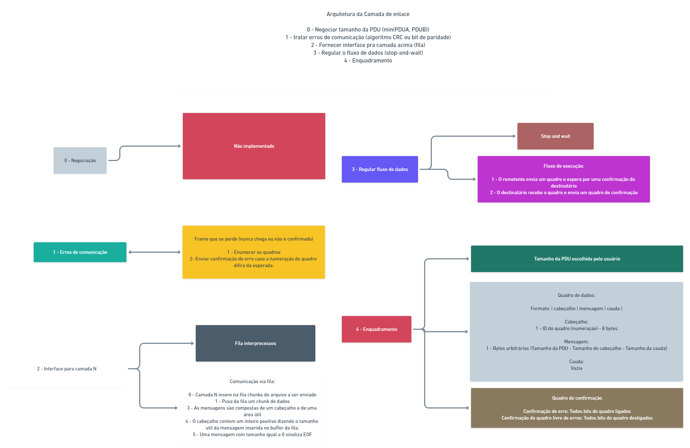

# FRC-Projeto-1

## Descrição

Este projeto consiste em uma aplicação que possibilita o envio de arquivos via camada de enlace de dados entre hosts.
Em poucas palavras, um host iniciará a aplicação como remetente, enquanto o outro iniciará a aplicação com destinatário.
Neste momento, vários arquivos poderão ser enviados o quanto se queira. O arquivo a ser enviado pode ser de qualquer formato ou natureza.

## Utilização

Confira este [vídeo](https://youtu.be/xThKL7FVCgs) que demonstra a utilização.

Assumindo que a aplicação será executada em ambiente Linux, em específico no Ubuntu, os seguintes passos poderão ser seguidos para a correta execução:

### Instalando dependencias

Para correta execução do projeto, são necessários os seguintes pacotes:

#### GCC
```bash
sudo apt install gcc
```
#### Make
```bash
sudo apt install make
```

#### Git
```bash
sudo apt install git
```
### Baixando o código fonte

No diretório de sua preferência, baixe os arquivos necessários utilizando o seguinte comando:
```bash
git clone https://github.com/VictorJorgeFGA/FRC_Project1.git
```

### Compilando o projeto

Dentro da pasta do projeto, execute o seguinte comando:
```bash
make
```

### Executando o projeto
Como explicado na [descrição](#descrição), um host iniciará a aplicação como remetente e o outro como destinatário.
Confira como iniciar cada parte.

---
#### Remetente

O remetente deverá iniciar a camada de enlace de dados em modo `SENDER` e então iniciar a aplicação também em modo `SENDER`.
Para inicair a camada de enlace de dados, execute o seguinte comando:
> Substitua o campo <endereco_destinatario> pelo endereço da máquina destinatária.
>
> Caso você esteja executando em loopback, atente-se para utilizar portas diferentes para entrada e saída de dados
```bash
./bin/prog 0.0.0.0 5000 <endereco_destinatario> 5000 SENDER
```

Em seguida a aplicação poderá ser iniciada através do seguinte comando:
```bash
./bin/prog SENDER
```
---
#### Destinatário
O destinatário deverá iniciar a camada de enlace de dados em modo `RECEIVER` e então iniciar a aplicação também em modo `RECEIVER`.
Para inicair a camada de enlace de dados, execute o seguinte comando:
> Substitua o campo <endereco_remetente> pelo endereço da máquina remetente.
>
> Caso você esteja executando em loopback, atente-se para utilizar portas diferentes para entrada e saída de dados
```bash
./bin/prog 0.0.0.0 5000 <endereco_remetente> 5000 RECEIVER
```

Em seguida a aplicação poderá ser iniciada através do seguinte comando:
```bash
./bin/prog RECEIVER
```
---
### Enviando arquivos
Com a camada de enlace de dados e a aplicação rodando, na máquina remetente, digite o caminho do arquivo a ser enviado pela rede ao destinatário.
`Enter the file name to be sent, or \exit to exit: <nome_arquivo>`
> Um arquivo de imagem para testes é fornecido no repositório. Para enviá-lo, substitua <nome_arquivo> por test.jpg

### Recebendo arquivos
Com a camada de enlace de dados e a aplicação rodando, na máquina destinatária, digite um nome para salvar o arquivo.
`Enter the file name to be received, or \exit to exit: <nome_arquivo>`
> Caso a imagem de testes esteja sendo recebida, você pode substituir <nome_arquivo> por test_copy.jpg, por exemplo.

---
## Documentação

Nos _header files_ (arquivos `.h` que são encontrados na pasta `/inc`), as funções recebem comentários em sua definição as explicando em poucos detalhes. Entretanto, para uma visão macro da aplicação, serão explicados cada módulo que a compõe.

### Interface camada N para camada N-1

A interface entre a camada N e a camada N-1 é composta por uma fila de mensagens abstraída dentro de um módulo que fornece funções bem definidas para comunicação. As funções vêm em pares logicamente coesos, isto é, uma função para inserir e outra para extrair informações de uma camada específica.

A interface foi desenhada com proposito de ser utilizada pela camada N e pela camada N-1 apenas. Para a camada N (aplicação), temos duas funções úteis para estabelecer a comunicação, isto é, uma função para enviar dados para a camada de enlace de dados e outra para receber dados da camada de enlace. O mesmo vale para a camada de enlace de dados.

A implementação desta interface foi feita utilizando a fila de mensagens `mqueue`, ou seja, fila de comunicação _POSIX_.

---
### Aplicação

A aplicação possui dois modos de funcionamento, a saber: envio, recebimento.

No modo de envio, a aplicação abrirá o arquivo que o usuário desejar e o quebrará em _chunks_ que serão empurrados para a camada de enlace de dados, **que também deverá estar operando em modo de envio**.

No modo de recebimento, a aplicação abrirá (ou criará se não existir) o arquivo apontado pelo usuário, e receberá da camada de enlace os chunks do arquivo a ser recebido, e montará o arquivo com os _chunks_ recebidos.

A comunicação entre os pares de aplicação é bem estabelecida e seguem regras. Estas regras são:

1. Um chunk terá um cabeçalho que diz o quanto do buffer possui mensagem útil (Inteiro de 4 bytes).
2. Um chunk que indica tamanho 0 significa _EOF_ (_End Of File_).

---
### Camada de enlace de dados

A camada de enlace de dados, assim como a aplicação poderá rodar nos modos de envio e recebimento.

No modo de envio, a camada de enlace de dados utilizará interface para receber os chunks vindos da aplicação e enviá-los ao destinatário. Aqui é importante notar que a camada ficará travada à espera de novos chunks vindos da interface caso ainda não exista nenhum chunk disponível. Em poucos detalhes, o modo de envio da camada de enlace de dados opera da seguinte forma:

- Espera por dados da aplicação
- Enquadra os dados
- Envia os dados para o destinatário
- Espera por um frame de confirmação
- Checa o frame de confirmação (E repete o envio em caso de erros)

No modo de envio, a camada de enlace de dados utilizará o mecanismo de soquete para receber dados do remetente. Aqui a camada também ficará travada até que se receba dados vindos do remetente. O modo de envio da camada de enlace de dados no modo de recebimento opera da seguinte maneira:

- Espera por dados vindos do remetente
- Checa o frame recebido
- Envia o frame de confirmação
- Desenquadra o frame
- Empurra os dados para a fila com destino à aplicação

### Esquemático Arquitetura da camada de enlace


